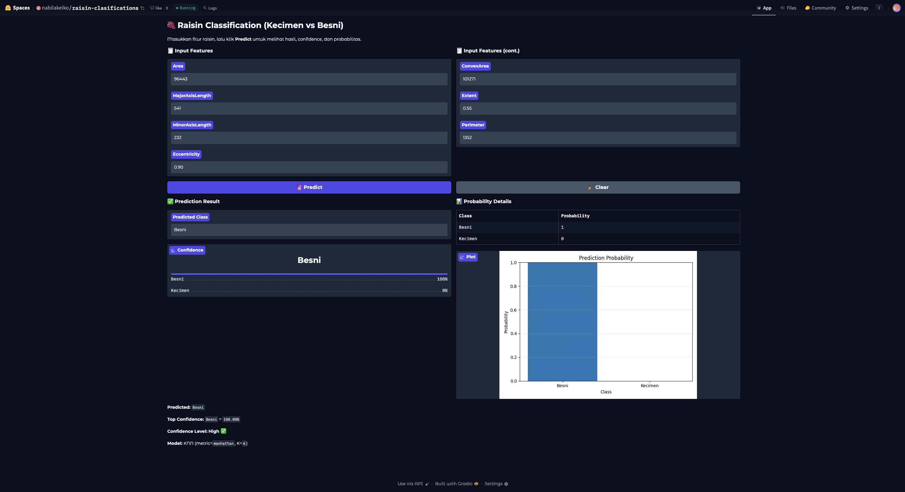

# 🍇 Raisin Classification (Kecimen vs Besni)

Machine Learning classification project using K-Nearest Neighbors (KNN) to classify raisin types.

## 📌 Project Overview
This project predicts whether a raisin belongs to:
- **Kecimen**
- **Besni**

Based on morphological features:
- Area
- MajorAxisLength
- MinorAxisLength
- Eccentricity
- ConvexArea
- Extent
- Perimeter

---

## ⚙️ Model Details
- Algorithm: K-Nearest Neighbors (KNN)
- Distance Metric: Manhattan
- Feature Scaling: StandardScaler
- Evaluation: Accuracy, Confusion Matrix, Probability Output

---

## 📊 Model Performance
(89%)  

---

## 🖥️ Web App (Deployed)
Live Demo:
👉 https://huggingface.co/spaces/nabilakeiko/raisin-classifications

---

## 📷 Application Preview

---

## 🚀 Tech Stack
- Python
- Scikit-learn
- Pandas
- Gradio
- HuggingFace Spaces

---

## 🎯 Skills Demonstrated
- Data Preprocessing
- Feature Scaling
- Model Training & Evaluation
- Model Deployment
- UI Development
- Reproducible ML Workflow
