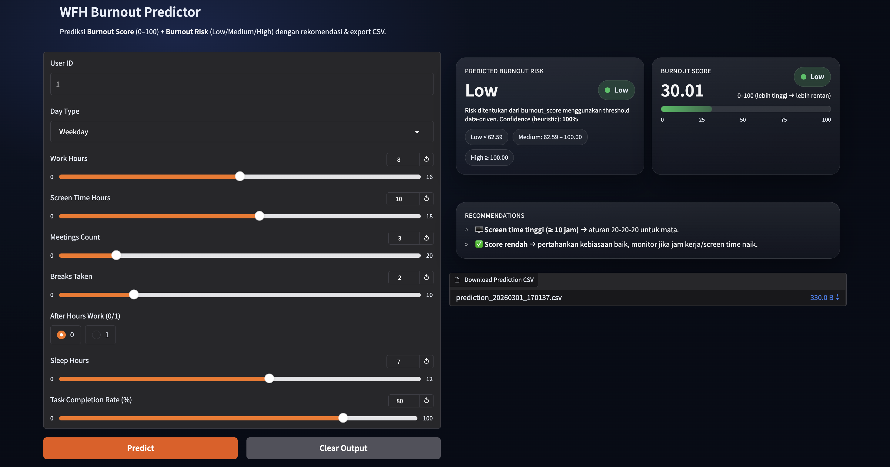

# 🧠 WFH Burnout Risk & Score Predictor

End-to-end machine learning project to predict employee burnout risk using behavioral and productivity indicators during remote work (WFH).

---

## 🎯 Problem Statement

Remote work increases flexibility but may also elevate burnout risk due to:

- Long working hours  
- High screen exposure  
- Low sleep duration  
- Frequent meetings  
- After-hours work  

This project predicts:

- 🔢 **Burnout Score (0–100)**
- 🚦 **Burnout Risk Category (Low / Medium / High)**

---

## 📊 Dataset Features

| Feature | Description |
|----------|------------|
| work_hours | Daily working hours |
| screen_time_hours | Total screen exposure |
| meetings_count | Number of meetings |
| breaks_taken | Number of breaks |
| after_hours_work | 0/1 indicator |
| sleep_hours | Sleep duration |
| task_completion_rate | Productivity %

---

## 🧪 Modeling Approach

### 1️⃣ Regression Model
- RandomForestRegressor
- Target: `burnout_score`

### 2️⃣ Risk Mapping
- Threshold-based categorization
- Data-driven quantile boundaries

---

## 📈 Model Performance

- MAE: 4.9688
- RMSE: 6.2514
- R²: 0.9307

---

## 🖥️ Interactive Web App

Deployed via HuggingFace Spaces:

👉 **Live App:**  
https://huggingface.co/spaces/nabilakeiko/wfh-burnout

### UI Preview

---

## 💡 Business Insight

This tool can be used by:

- HR teams to monitor burnout risk
- Managers to redistribute workload
- Individuals to self-assess burnout signals

---

## 🛠️ Tech Stack

- Python
- Scikit-Learn
- Pandas / NumPy
- Gradio
- HuggingFace Spaces

---

## 👩‍💻 Author

**Nabila Keiko**  
Data Analyst / Aspiring Data Scientist
